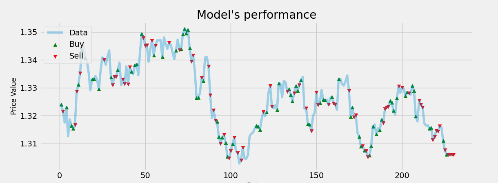

# Deep Reinforcement Learning

This repo contains the algorithm used to trade fores in [Project Apatheia](https://github.com/Sianwa/Project-Apatheia). It uses common python libraries to train the model. all mentioned in the requirements.txt file.
*****
### Model Performance

The pandas data-reader libray was used to mimic live data streaming, by pulling data from alphavantage. The model then used price difference at a given look back window period to predict which action to take. The green arrow show where the model bought and the red arrows show where the model sold.

